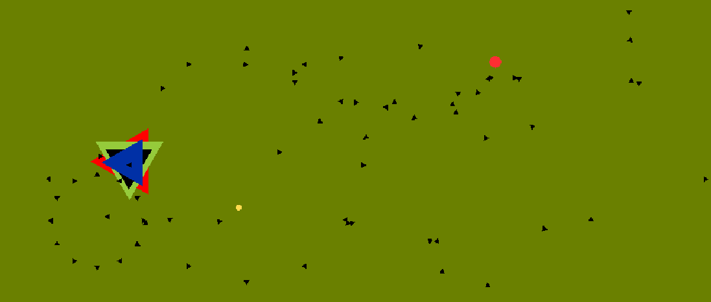

ゲーム制作技術総合実習 個人ワーク
（Circle, Triangle, Squareを使用した2Dゲーム）

# リフレクショントライアングル

## ゲームの内容
プレイヤーを動かして、敵の△をよけて生き残る。
緑のシールドに△が当たる,もしくは一定時間おきにエネルギーが出現する。
それを取得するとエネルギーレベルが上がる。
10レベルになるとプレイヤーがリフレクションモードに変わり、△を反射できるようになる。
効果は15秒です。
△を反射してボスにダメージを与えて、ボスを倒せばゲームクリア。
右から出てくるオレンジ色はボスに与えたダメージです。
自分の与えられるダメージは1で、ボスの体力は610です。

## 操作説明
- 矢印キー、若しくはW,A,S,Dキーで上下左右にプレイヤーが移動する
- スペースキーを押すとシールドのオンオフを切り替えれる
